# TopSwagCode.Blazor.Hosting

Create simple test app

Ratings:

AWS
* Ease of use: 7/10
* Pricing : 7 / 10
* Features : 8 / 10
NO ssl without using Cloudfront.

Github Pages
* Ease of use: 7/10
* Pricing : 10 / 10 // Cant beat free :)
* Features : 5 / 10
Free and easy SSL.

Azure
* Ease of use: 4/10 (upload really anoying to create folders manually)
* Pricing: 7/10
* Features: 8/10 
Need to add Azure CDN to get SSL

Google

Written mini review.

Ease of use:
Ease of use is default 7, I found these to be easy to use, but there is always a learning curve if your new to the product. I found azure to be anoying for the way they support uploading of files. I know it is meant to be used from server side code, but still annoys me :)

Pricing:
I found all the offerings to be cheap, without going to deep in their pricings. If you have a site that are visited 5millions times a second, it would be a good idea to make your own research. For personal projects Github pages gets a clear 10/10 with their free hosting.

Features:
Well they are all pretty similar in their default storage offerings. Easy Website hosting with the exception being Github pages. They support index page and 404 page. But my 404 page cannot be my index page, which is a big problem for Single Page Apps like Blazor. Blazor controlls routing, which means we have to make a ugly hack to redirect 404 to index. This means all reloads redirects to index page. The other offers us to pick which files to serve. This lets us pick both index.html as 404 and index page.

None of the cloud providers supports SSL for their storage directly. You have to use their CDN offering on top. Github pages supports SSL out of the box

Final Notes:
To be honest I don't think there is any clear winner. Pick the one you are already using today. If you don't mind a ugly hack and redirects to index after reload pick Github pages. My goto is going to be AWS, since I already have been working alot with it and have my blog hosted on S3 with Cloudfront CDN in front of it. 

Read about how to setup your own hosting on the cloud of your choice here:

* AWS
* Azure
* Github Pages
* Google

# AWS S3

AWS has S3 storage that can be used to host static sites. Including Blazor apps. To do so, goto S3 in the AWS dashboard. Press Create Bucket.

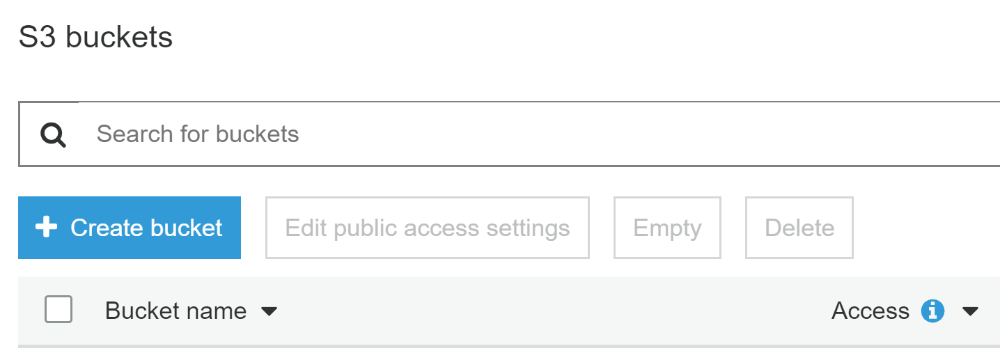

Here you will be greated by a wizard for creating the bucket. I will be naming my bucket blazor-aws.topswagcode.com because I am planing on creating http://blazor-aws.topswagcode.com

Click next.

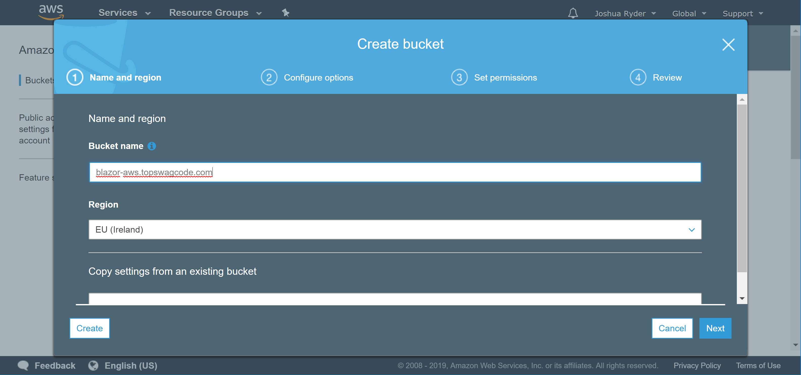

Options tab we will just keep defaults and press next.

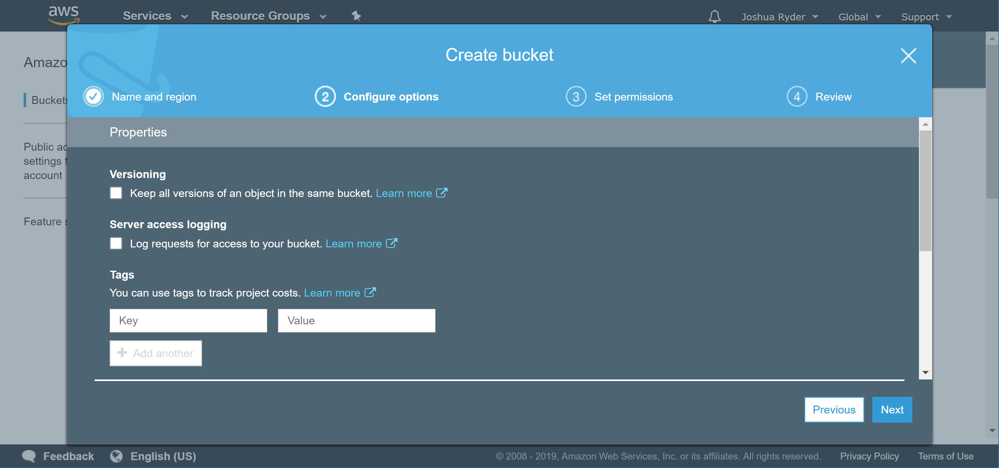

On the next page we want to remove the 4 checkboxes as shown below. The reason for this is we want to create a public bucket for our new WebApp.

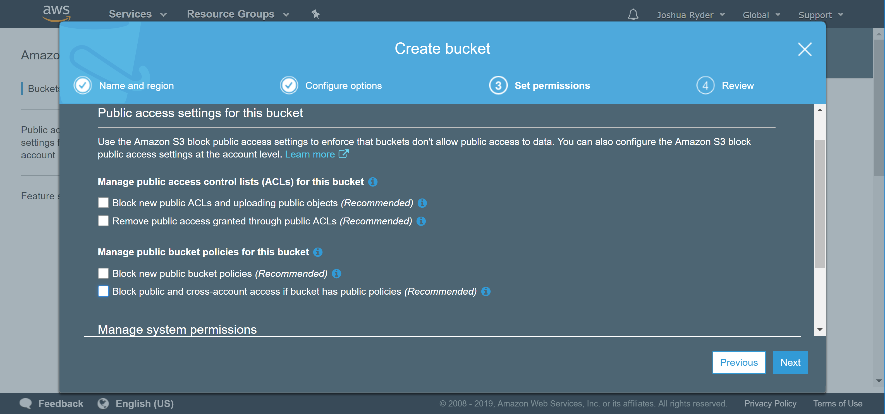

Review and create bucket.

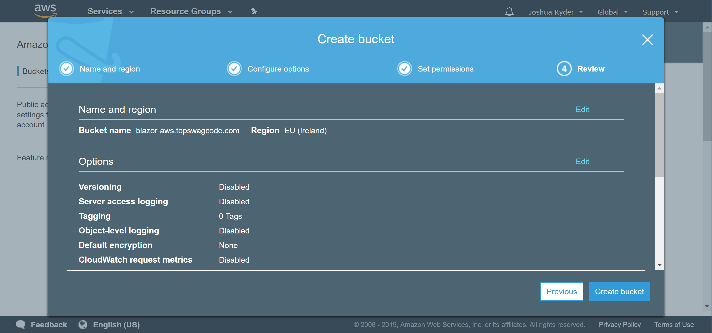

We can now see the new created bucket. 

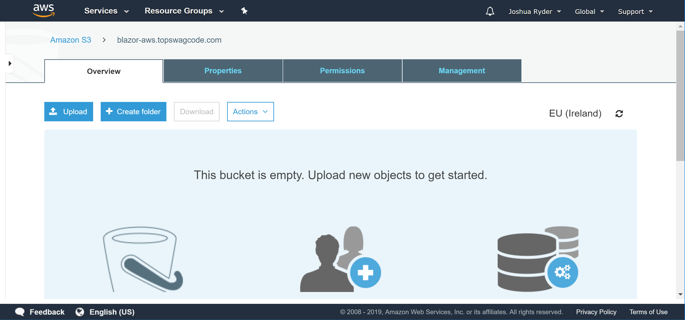

Next step is now to upload the static site. Press upload.

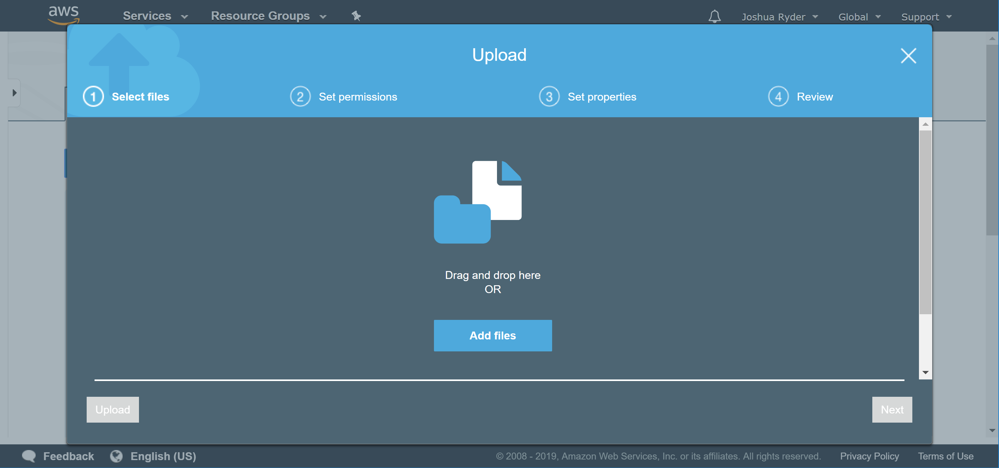

Just drag and drop all the files to upload them. When all has been uploaded press next.

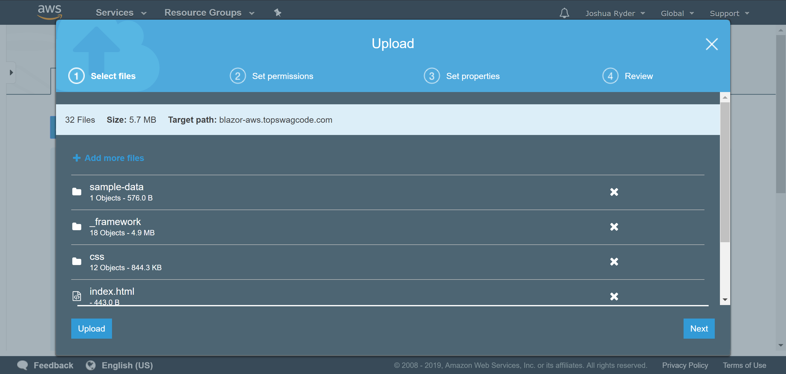

For permissions it's important to change "public permissions" to be "Grant public read access to the object(s)", so people can access your website. Click next to continue to preperties.

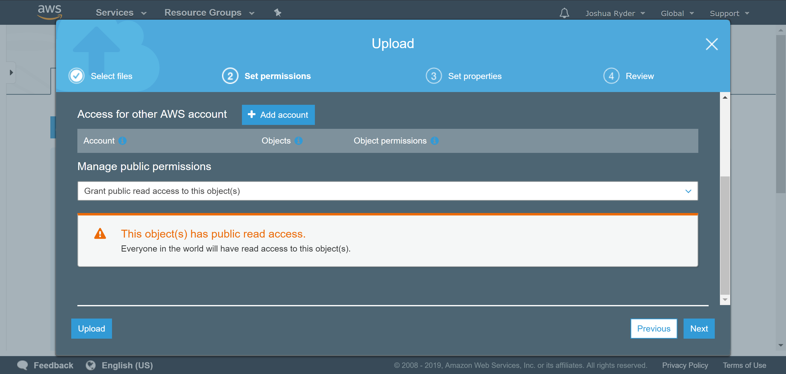

Not much to say here. Just go with the defaults and click next.

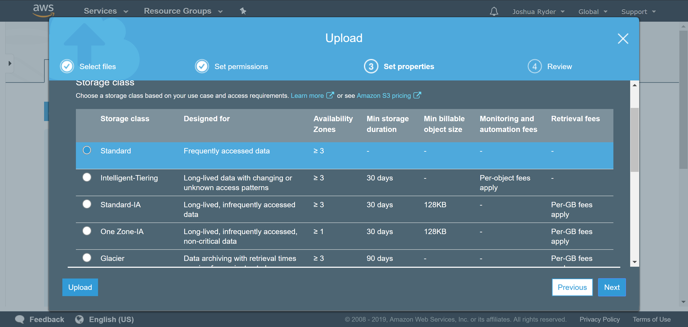

Again not much to say. Just quick review and click upload.

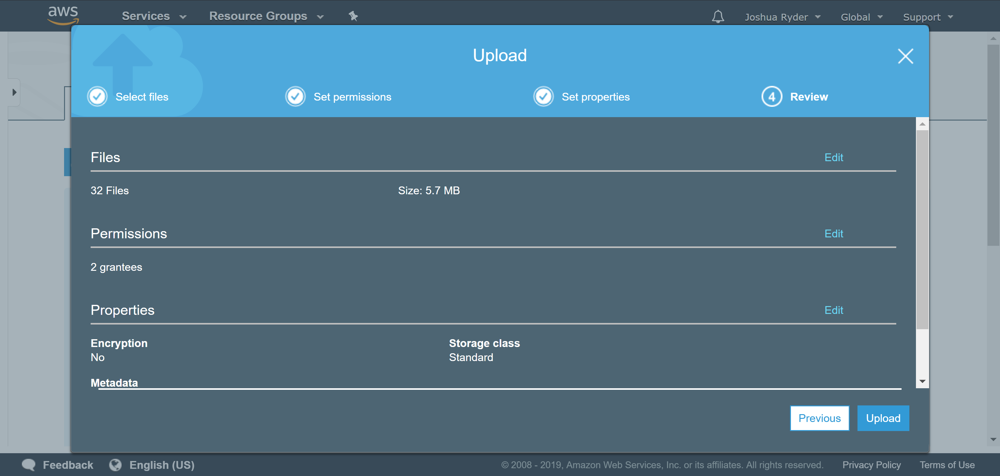

With the files uploaded, it is now time to setup the hosting. Click the "Properties" tab and click "Static website hosting".

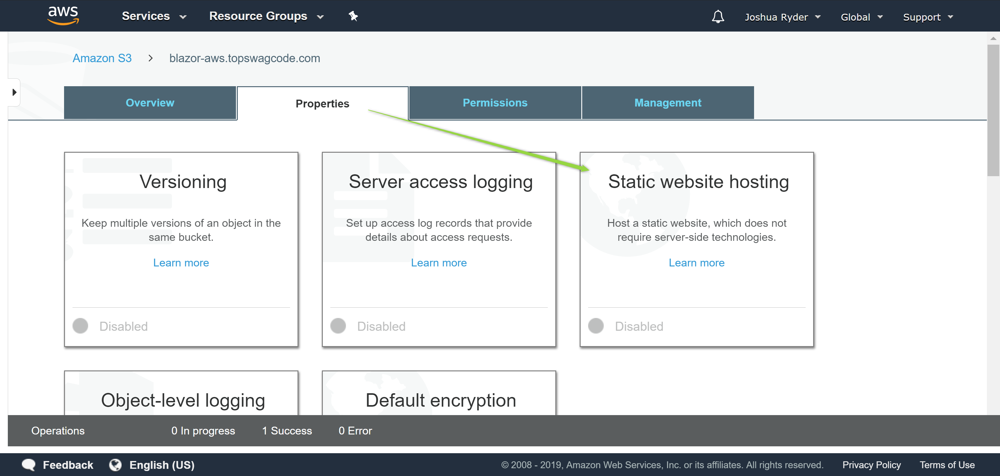

Pick "Use this bucket to host a website". Use index.html for both index and error document. The reason is to let the Blazor app handle routing. Press save and you now have a Blazor App hosted on S3 really cheap! :)

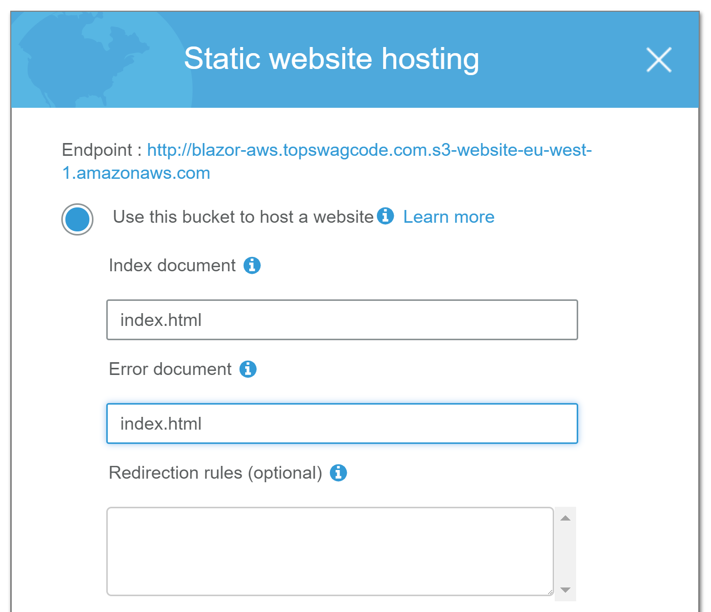

Visit my Blazor hosted app on AWS here:    
[http://blazor-aws.topswagcode.com/]("http://blazor-aws.topswagcode.com/")

# Azure Blob storage

Azure has a storage offering that support hosting of static sites. Just press "Create a resource" and pick "Storage"

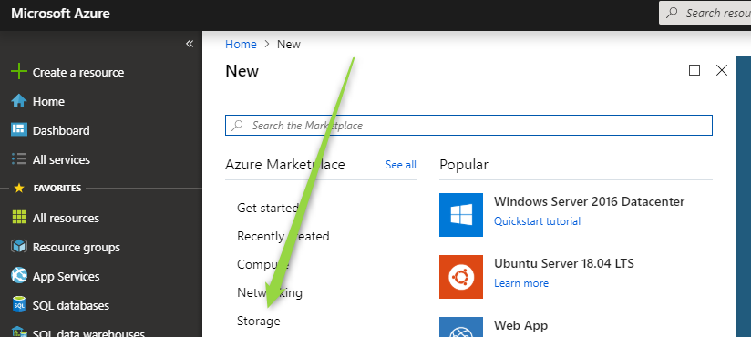

Here you have lot's of options on how you want the storage hosted. I have blured out my subscription and resource group. But simple pick an existing one or create new ones. For instance details I went with the defaults. 

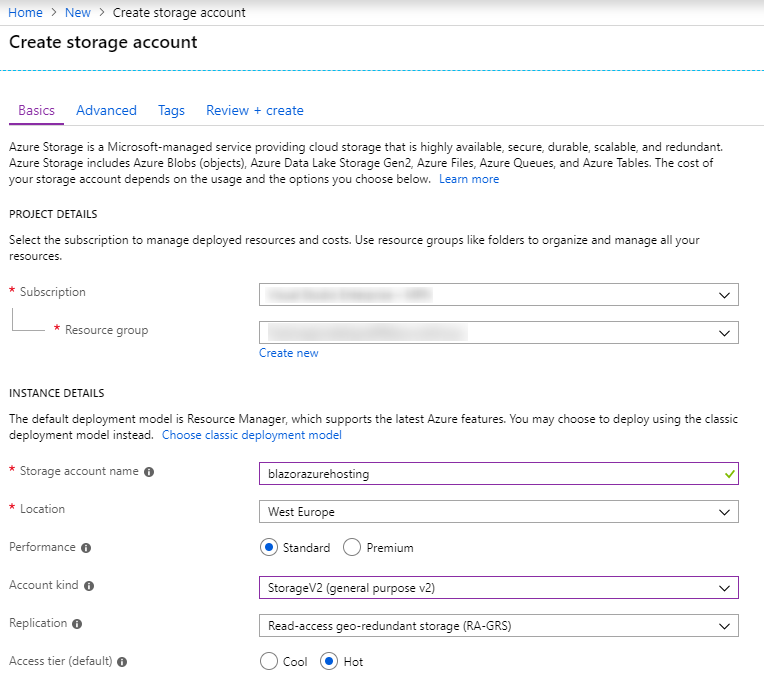

For "Advanced" options remember to Disable "Secure transfer required", since we will be creating a site on HTTP. If we wanted SSL, we would need to use Azure CDN offering.

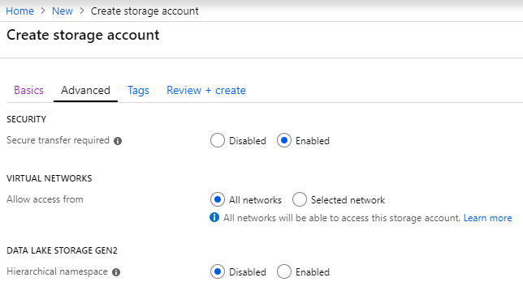

"Tags" and "Review" tab I had nothing to add and quickly just clicked next. 

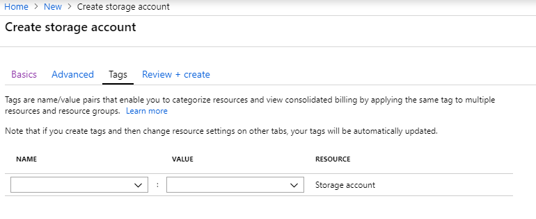

When you have created your Storage, you will just have to wait a couple of seconds for Azure to complete. This would be a good time to get some coffee. (Can be slow at times)

Now we are ready to enable Static website hosting.

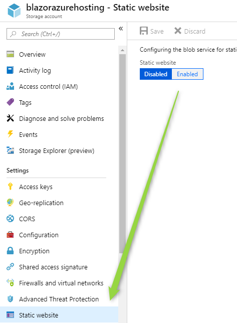

Inset Index.html as both Index and Error doucment.

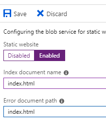

When you have saved the changes you will be greated with your new public awailble URL's, but we haven't uploaded anything to the storage. Azure will create a $web folder in your storage where your website should be uploaded.

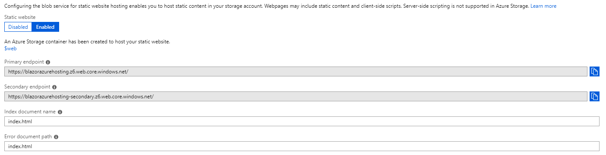

Goto the Storage Explorer and upload your Blazor site to the $web folder. It was midly frustrating uploading the site. Had to create all the folders manually and upload content into them. Might be a better tool for it out there.

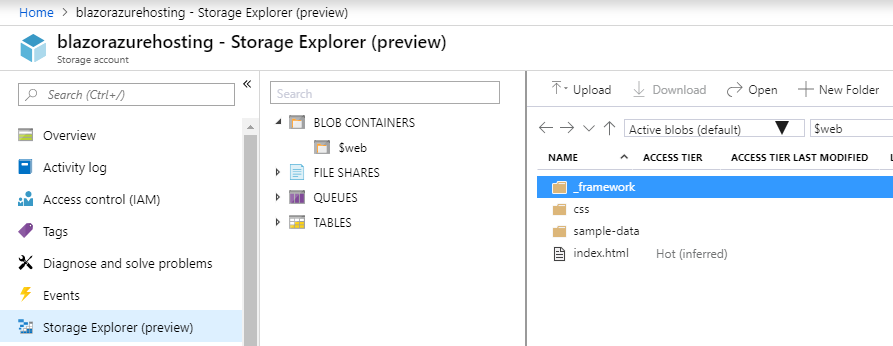

Visit my Blazor hosted app on Azure here: [blazor-azure.topswagcode.com]("http://blazor-azure.topswagcode.com)

# Google App engine

blazor-gae.topswagcode.com
https://cloud.google.com/storage/docs/hosting-static-website

# Github pages

For hosting on Github pages you need to create a new repo. "GithubUserName.github.io" and put your static site on it. 
You can see a mine [here.](https://github.com/kiksen1987/kiksen1987.github.io)

There are a couple of gotchas for Github pages when trying to host a single page app.

* Default routing back to index.html not supported
* Need a .nojekyll file

The first problem with no default routing control is a big pain by using Github pages. Instead they support custom 404.html page. I have created a 404 page which redirects to index.html as a hack. This means refreshing your WebApp on any page will redirect back to index. But for the price of free with custom domains, this is maybe a minor thing for you.

To setup static site hosting on Github, goto your repo. Click settings.

Scroll down to GitHub Pages section and enable it. You can then add a custom domain aswell.

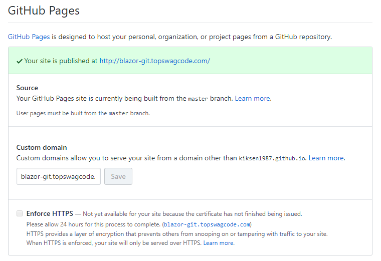

Visit my Blazor hosted app on Github here: [blazor-git.topswagcode.com]("http://blazor-git.topswagcode.com)

# Others